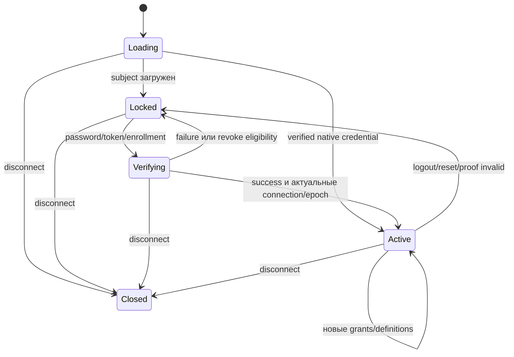

# XCore permissions: спецификация первой версии

Статус: спроектировано для реализации; runtime и protocol schemas пока не изменены.
Проверено 2026-10-06. Baseline и решения по issues — в
[roadmap](permissions-and-cloud-roadmap.md).
Этот документ уточняет раннее предложение и является нормативным для XCore.

## 1. Инварианты

1. Effective check не делает I/O и не блокируется. PermissionService работает
   на game thread; чистый engine работает с immutable input в любом потоке.
2. Отсутствующая Session/identity не превращается в console/system actor.
3. Grant задаёт eligibility, но не подтверждает identity. Privileged node
   требует актуальный authentication proof текущего подключения.
4. После cutover engine не читает Player.admin/PlayerData.admin. Единственный
   XCore writer native flag — lifecycle projection.
5. Expired rule не участвует даже при задержанном scheduler. Pending/stale ALLOW
   даёт DENY, а не переход к нижнему permissive rule/default.
6. Snapshot устанавливается целиком; late result не перезаписывает новое
   подключение, definitions, authentication или требуемую revision.
7. Security document не сохраняется через profile replaceOne.
8. Grant mutation и audit имеют общий commit; transport publish идёт после него.
9. Moderation rights не включают arbitrary permission management.
10. Migration preserving behaviour и исправления старых ошибок проверяются отдельно.

## 2. Компоненты и wiring

Package `org.xcore.plugin.permission`:

| Компонент | Ответственность | Зависимости |
| --- | --- | --- |
| PermissionNodes | Compile-time constants, catalog, legacy aliases | Чистый Java |
| PermissionEngine | Compile, match, decision/explain | Records и время аргументами |
| PermissionService | Main-thread subject/session validation и API | PermissionEngine, SessionService, server identity, clock/ticker |
| PermissionLifecycleService | Definitions, join/install, refresh, projection, expiry | PermissionService, Repository, SessionService, Async, display/status |
| PermissionManagementService | Validated intent, transaction/audit, notification | PermissionService, Repository, AuditService, MongoClient, NetworkService, Async |
| PermissionSubjectRepository | Projection reads и conditional security writes | MongoDatabase |

AdminAuthService остаётся входом password/token/enrollment. Получает repository
и lifecycle вместо полного profile save для credentials. Transport подключается
к существующим handlers; controllers остаются тонкими. Не нужны backend SPI,
resolver registry, permission bus и state-machine framework. Records лежат рядом.

Constructor injection в существующем Avaje scope. PermissionService зависит от
SessionService; SessionService не зависит от permissions. Join orchestrates
ConnectionHandler/lifecycle, поэтому новый cycle не появляется. XCoreSender
не внедряется в service. Convenience hasPermission делегирует service, не владеет им.
ConfigFactory создаёт config/clock beans; тесты передают controlled clock/ticker.
Definitions загружаются после migrations через PluginStartupCoordinator.
Shutdown отменяет periodic task и игнорирует late callbacks. Constructors без I/O.

## 3. Catalog и subjects

```java
enum AccessKind { PUBLIC, STAFF, LOCAL_CONSOLE }
enum DefaultAccess { ALLOW, DENY }
record PermissionNode(String name, String descriptionKey,
                      AccessKind kind, DefaultAccess defaultAccess) {}

sealed interface PermissionActor {
    record PlayerActor(String uuid, UUID connectionId) implements PermissionActor {}
    record LocalConsole(String server) implements PermissionActor {}
    record RemoteConsole(String sourceServer) implements PermissionActor {}
    record SystemActor(String source) implements PermissionActor {}
}
```

Это signatures контракта; nullness/annotations уточняются в реализации.
Actors создают trusted adapters, не имена пользователей. Null actor запрещён.
System actor — явная внутренняя операция с ограниченным набором intent, без
ambient bypass для любого вызова. Management допускает LocalConsole; migration
и Discord adapter имеют отдельный internal desired-state intent своего source.

Unknown непустой node всегда DENY, включая console. Empty Cloud permission
сохраняет значение «ограничения нет». PUBLIC может иметь ALLOW default без login;
STAFF default всегда DENY и требует proof при ALLOW. LOCAL_CONSOLE запрещён
player/remote, независимо от ролей и `*`. Local console получает известные rights;
remote сохраняет trusted-console semantics обычных server commands.

Старый `admin` — временный alias `mindustry.admin`, не имя роли. Catalog готов
до регистрации commands. После registrar проверить string leaves compound Cloud
permissions; typo XCore command останавливает startup. Predicate permissions
не преобразуются в строки. External integration объявляет node до validation;
никакого автоматического permissive default. Cloud composite проверяется через
`manager.testPermission(sender, permission).allowed()`.

### Первые узлы

Все нижеперечисленные узлы STAFF/DENY, кроме management LOCAL_CONSOLE/DENY.
В COMPAT они используют прежнюю active-admin policy, кроме новых inspect/manage.

| Node | Текущая граница |
| --- | --- |
| mindustry.admin | Native engine/client compatibility |
| xcore.moderation.ban / unban / mute / unmute / kick | Отдельные moderation actions |
| xcore.moderation.audit / audit.others | Staff history; own history UI сохраняет прежнюю обычную policy |
| xcore.moderation.votekick.immune | Нынешняя active target admin immunity |
| xcore.admin.tp / broadcast / kill / heal | Существующие strings сохраняются |
| xcore.admin.set-team / trace / wave | Конкретные commands/native packet actions |
| xcore.maps.force-rtv / force-vnw | Обход map/wave vote |
| xcore.votes.cancel | vote c |
| xcore.events.create-major / edit-major / edit-others | Privileged части event flows |
| xcore.players.settings.others / private-info | Настройки другого игрока и закрытые profile fields |
| xcore.bypass.playtime | Нынешний playtime bypass |
| xcore.permissions.inspect.others | Новая диагностика другого субъекта |
| xcore.permissions.manage | Новые mutation/enrollment/reload endpoints |

PUBLIC node для каждого chat/UI endpoint пока не нужен. Не добавлять
bypass.mute/disabled-command: нынешние guards таких исключений не обещают.
Требование authentication принадлежит узлу. Второго requiresAuthentication
на role definition нет; direct grant и wildcard проверяются тем же способом.

## 4. Definitions и grants

Общий файл `<globalConfigDirectory>/permissions.toml` рядом с secrets.toml,
с нынешним разрешением global directory. Missing file создаёт template в
COMPAT/SHADOW; ROLES требует утверждённый валидный файл.

```toml
schemaVersion = 1
refreshIntervalSeconds = 30
maxSnapshotAgeSeconds = 60

[roles.default]
permissions = []

[roles.moderator]
permissions = ["xcore.moderation.mute", "xcore.moderation.unmute",
               "xcore.moderation.kick", "xcore.moderation.audit",
               "xcore.moderation.audit.others"]

[roles.admin]
parents = ["moderator"]
permissions = ["xcore.*", "-xcore.permissions.*",
               "xcore.permissions.inspect.others", "mindustry.admin"]

[roles.event-organizer]
permissions = ["xcore.events.create-major", "xcore.events.edit-major",
               "xcore.events.edit-others", "xcore.maps.force-rtv"]

[roles.senior-moderator]
parents = ["moderator"]
permissions = ["xcore.moderation.ban", "xcore.moderation.unban"]

[discord]
guildId = "900000000000000001"

[[discord.roleBindings]]
roleId = "900000000000000002"
role = "moderator"

[[discord.roleBindings]]
roleId = "900000000000000003"
role = "admin"
```

IDs в примере — placeholders. Для третьего уровня добавить binding на
senior-moderator; для регионального staff указать server в binding.
Parents разворачиваются один раз. Default применяется без stored grant.
Unknown parent/cycle/malformed pattern/противоположные duplicate rules внутри
одной definition отклоняются. Конфликты разных ролей допустимы. Unknown assigned
role не даёт rights, но видна в info. Definitions hash считается по нормализованной
модели без comments/order. Config deploy распространяет definitions на серверы;
RoleUpdatedV1 не нужен. Invalid reload сохраняет прежнюю модель в памяти.
Scope отсутствует в definitions: он целиком на назначении.

```java
record RoleDefinition(String id, List<String> parents, List<PermissionRule> rules) {}
record PermissionRule(String pattern, boolean allow) {}
record GrantSource(String kind, String key) {}
record GrantMetadata(UUID id, String server, Instant expiresAt,
                     GrantSource source, AuditActor grantedBy,
                     Instant grantedAt, String reason) {}
record RoleGrant(String role, GrantMetadata metadata) {}
record NodeGrant(String pattern, boolean allow, GrantMetadata metadata) {}
```

Server null — global, иначе точное стабильное имя из server registry. Expiry null
— бессрочно; `now >= expiresAt` прекращает правило. Write отклоняет unknown
role/server, invalid pattern, expiry в прошлом. Имена nodes lowercase ASCII;
UUID не приводятся к lowercase. Wildcard только `*` или последний `.*`;
`a.*` не совпадает с самим `a`. Regex, implicit parent и gamemode contexts нет.
Reason обязательна для admin mutation. Source key стабилен: reconciliation
`discord-role:<guildId>:<roleId>:<server-or-*>` меняет только свои grants;
manual source остаётся.
До 128 role grants и 256 node grants на subject: bounded lookup без tuning SPI.

## 5. Resolution и snapshot

Compile создаёт direct index и roles index: pattern -> короткий список rules
с value/scope/expiry/source. Candidate ancestor patterns объявленных nodes
подготовлены catalog. Одинаковые правила разных grants сохраняют lifetime/source.

```text
unknown node -> DENY
console -> origin policy
LOCAL_CONSOLE node + player -> DENY
найти current matching direct rule
иначе найти current matching role rule
иначе catalog default
winning DENY -> DENY
winning Mongo-backed ALLOW pending/stale -> DENY без fallback
STAFF ALLOW без актуального proof -> DENY
иначе -> ALLOW
```

Current rule соответствует серверу и не истекла. Нельзя тихо убрать stale/locked
ALLOW до lookup: это может открыть нижнее permissive правило. При pending новой
revision весь STAFF доступ запрещён; PUBLIC продолжает применять известные DENY.
PUBLIC default не требует Mongo freshness. ROLES join не завершается до initial
authoritative subject/credential summary; отсутствующая Session не имеет STAFF rights.

Внутри direct или roles: exact -> наиболее длинный wildcard -> `*`;
при равенстве scoped -> global; затем DENY -> ALLOW. Direct overrides — отдельная
старшая группа независимо от specificity роли. Child не получает скрытого
приоритета над parent. Role weights отсутствуют.

| Rules | Query | Result при valid proof |
| --- | --- | --- |
| role moderation.*, role -moderation.ban | ban | DENY |
| role -moderation.*, role moderation.mute | mute | ALLOW |
| parent exact deny, child exact allow | тот же node | DENY |
| scoped wildcard allow, global exact deny | scoped server | DENY |
| scoped exact allow, global exact deny | scoped server | ALLOW |
| direct -xcore.*, role exact allow | node | DENY |
| direct exact allow, role exact deny | node | ALLOW |
| expired direct deny, current role allow | node | ALLOW |
| stale direct allow, current role allow | node | DENY, не fallback |
| role *, неизвестный node | unknown | DENY |

```java
record PermissionSnapshot(long revision, long definitionsGeneration,
                          String definitionsHash, Instant loadedAt,
                          long freshUntilNanos, CompiledRules rules,
                          CredentialSummary credentialSummary) {}
record PermissionExplanation(boolean allowed, DecisionReason reason,
                             String node, RuleOrigin winningRule,
                             String server, Instant expiresAt,
                             long revision, String definitionsHash) {}
```

`has` без trace allocations; explain собирает подробности по запросу. Не выводить
credential hashes/USID/secrets. `perm check --eligible` явно hypothetical:
показывает результат при успешной authentication. Offline profile active Session
не имеет. Freshness — monotonic ticker, expiry — UTC Clock. Mongo-backed ALLOW
отключается при age >= maxAge. Действующий DENY не исчезает от утраты freshness.
Verified native source локален и проверяется credential adapter, без Mongo lease.
Это освобождает только его собственный ALLOW от lease; explicit DENY, AccessKind
и pending новой authoritative revision всё равно действуют.

## 6. API и action boundary

```java
boolean has(Session session, String node);
boolean has(Player player, String node);
boolean has(XCoreSender sender, String node);
PermissionActor actor(Session session);
void require(PermissionActor actor, String node);
PermissionExplanation explain(Session session, String node);
```

Player overload проверяет `session.player == player`, current connection ID
и membership Session в SessionService. UUID-only lookup не авторизует старый
Player после reconnect. Require использует тот же engine и localized domain error.
CloudManagerFactory: `manager.setPermissionChecker(permissionService::has)`.

UI render check — presentation. Callback/reducer проверяет node заново, даже
если модель сохранила canBan=true. Async action: main capture -> target lookup
в worker -> main session/permission recheck -> принять immutable intent ->
storage commit -> main effect/result. Worker не получает mutable Player/PlayerData.
Принятие intent — точка авторизации: revoke не отменяет уже начатый commit.
Многовходовая операция проверяется на общей границе, не в Mongo repository.

ModerationActor сейчас содержит только name/Discord и допускает null -> CONSOLE.
Добавить UUID/connection/origin; checked actions не используют этот fallback.
Legacy low-level методы остаются лишь для явно названных system/transport effects.

## 7. Mongo model и commit

Одна новая collection permission_subjects. Grants и staff credentials принадлежат
одному subject; отдельная enrollment database не нужна. Это уточнение roadmap:
оставлять credentials в whole-saved PlayerData небезопасно для миграции.

```json
{
  "_id": "player-uuid",
  "schemaVersion": 1,
  "revision": 12,
  "credentialEpoch": 3,
  "discordBinding": {
    "guildId": "900000000000000001",
    "discordId": "900000000000000004"
  },
  "roleGrants": [
    {"role": "moderator", "id": "grant-uuid", "server": "event",
     "expiresAt": "2026-10-13T12:00:00Z",
     "source": {"kind": "manual", "key": "grant-uuid"},
     "grantedBy": {"type": "SERVER_CONSOLE", "id": "event"},
     "grantedAt": "2026-10-06T12:00:00Z", "reason": "дежурство"}
  ],
  "nodeGrants": [],
  "credentials": {
    "passwordHash": "<existing bcrypt hash>",
    "deviceTokens": [],
    "enrollment": null
  }
}
```

Repository не наследует whole-saving DataRepository. Два projection reads:
authorization state с epoch/token summary и credential view с BCrypt hash
только для storage/auth stage. Credentials не попадают в info/protocol/audit.
Discord binding для security sync authoritative здесь; old profile Discord
fields — read/display mirror, их whole save не меняет binding. Link/unlink
обновляет binding/grants/revision с profile mirror в общей transaction.
Non-unique index (discordBinding.guildId, discordBinding.discordId) позволяет
найти все linked subjects; bot читает safe projection без credential hashes.
Token hashes с известным expiry переносятся; legacy hash без восстановимого
expiry не становится бессрочным remembered token.

Blocking transaction выполняется bounded StorageExecutor. Использовать один
sync Mongo path для feature, не вводить параллельно ещё и reactive backend.
Existing document write: `_id + expectedRevision`, owned `$set/$push/$pull`,
`$inc revision`. Absent: insert revision=1; DuplicateKey ведёт к retry intent.
Не использовать revision-filter upsert на существующий _id. Пустой subject
не удалять: revision остаётся монотонной и служит revocation tombstone.

1. Main проверяет local origin/intent, captures expected revision и operation ID.
2. Transaction проверяет receipt: тот же operation ID + intent hash возвращает
   тот же результат; другой intent hash означает CONFLICT.
3. CAS write и AuditService.append(ClientSession, ...) идут в этой transaction.
   Audit failure/exception отменяет всё. CAS conflict — reread/retry до трёх раз.
4. После commit result содержит revision/grant ID/authorization view. Main
   устанавливает result, если он актуален; transport публикует invalidation.
5. Publish failure не превращает committed grant в failed mutation: вернуть
   saved result с предупреждением о доставке, periodic reload завершит sync.

Audit actions: PERMISSION_GRANT/REVOKE/OVERRIDE/SYNC, STAFF_ENROLL/CREDENTIAL_RESET.
Receipt — `details.extra.permissionOperationId` с unique partial index только
для этого поля; старый moderation dedupe не меняется. Записать intent hash,
returned revision/grant ID, actor/origin, target, before/after, source/scope/expiry.
Secret/password/token hashes исключены. Existing readers/UI должны понимать
новые enum values до начала записи новых actions.
Expiry не требует delete/write. Info --all показывает expired grants. В первой
версии scheduler разных серверов не генерирует повторные EXPIRED audits: expiry
уже записан при grant. TTL index на whole subject запрещён.

## 8. Authentication и полный enrollment path

```java
enum ProofMethod { PASSWORD, DEVICE_TOKEN, VERIFIED_NATIVE }
record AuthenticationProof(ProofMethod method, long credentialEpoch,
                           Instant expiresAt, String credentialId) {}
```

Proof связан с connection. Password proof действует до logout/disconnect/epoch
change. Token proof дополнительно требует current token ID и expiry в summary.
Native proof требует local UUID+USID registry entry и прежнюю IP policy.
Proof не переносится при server transfer. Target сервер заново проверяет
credentials; scope отдельно ограничивает rights. Старый password/token без
текущего STAFF eligibility не повышает права.



Active значит подтверждённую identity, не native admin. Установка state без
последнего staff eligibility снимает proof и повышает activationGeneration;
subsequent re-grant требует новой activation. Это относится и к definitions reload.
Отзыв одной роли сохраняет другие sources.
Глобальное гарантированное logout-all меняет epoch: даже пропущенные промежуточные
revoke/re-grant events не позволяют вернуть старый proof после reset.

### Новый moderator без Discord-admin роли

1. Local console выдаёт role grant online/offline игроку.
2. Для аккаунта без credentials оператор запускает `perm user #pid enroll`
   при online игроке, которого он идентифицировал. Command сообщает UUID/PID/name
   и выбранную connection. Это existing trusted-console операция.
3. Создать 256-bit secret на 10 минут. Subject хранит лишь hash, UUID, server,
   hash текущего player.usid(), connection ID и expiry. Secret после commit
   доставляется приватно этой connection; console/audit не логируют secret.
4. `/staff-setup <code> <password>` — PUBLIC player-only endpoint. Проверяет
   binding/deadline/актуальное staff eligibility. BCrypt выполняется worker.
5. Transaction consumes enrollment, пишет hash/epoch/audit. CAS предотвращает
   повторное потребление и late verification после revoke/reset. После commit
   актуальная connection получает PASSWORD proof; moderator остаётся native=false.

UUID/PID сами по себе не доказывают личность: оператор выбирает известного
человека/connection. Invite не создаётся автоматически при grant. Disconnect
делает binding непригодным для новой connection; invite перевыдаётся оператором.
Rotation отзывает прежний код. Enroll уже enrolled account возвращает ошибку;
explicit `--reset` сначала отзывает credentials/proofs, затем выдаёт новый invite.
Не давать пользователю самостоятельно создать staff password по одному UUID.

Существующие BCrypt, rate limits, cap 5 remembered tokens и TTL 60 дней сохраняются.
Все chat/mod auth
paths используют один async AdminAuthService flow. Нынешний synchronous BCrypt/Mongo
path AdminModIntegration устраняется в этом же изменении. Sensitive arguments
не включаются в logs/telemetry/traces; worker получает detached credential input.

Password reset/logout-all повышают credentialEpoch и отзывают tokens. Обычный
logout снимает текущий proof; optional revoke удаляет только переданный token.
Другие password sessions остаются, token sessions проверяют наличие token ID
после invalidation. Logout во время verification повышает activationGeneration:
late success не активирует вышедшего пользователя.

### Discord staff tiers и AdminTools compatibility

Discord roles становятся штатным источником grants первой версии. Для начала
два уровня: Mindustry Moderator -> moderator, Mindustry Admin -> admin.
При необходимости третий: Mindustry Senior Moderator -> senior-moderator
(добавляет ban/unban к moderator, без mindustry.admin). Количество bindings
не зашито в код; XCore parents задают inheritance, не высота Discord role.
Общий Mindustry Staff можно оставить для оформления/упоминаний, без grant.
Названия Discord roles произвольны; соответствие определяется immutable role ID.

Bindings находятся в общем permissions.toml (см. config example). Bot читает
тот же deployment config через PERMISSIONS_CONFIG_PATH; plugin — global directory.
Один configured guild. Binding roleId -> XCore role, optional server; без server
grant global. Duplicate (roleId, server), unknown role/server, invalid snowflake
отклоняются. Bot сверяет guildId с существующим DISCORD_GUILD_ID при startup.
Mapping hash — SHA-256 compact UTF-8 JSON отсортированных tuples
[guildId, roleId, role, server-or-null], IDs как decimal strings, без whitespace.
Он отделён от normalized role definitions hash. Config mismatch не применяет sync.

Source key `discord-role:<guildId>:<roleId>:<server-or-*>`. Каждый binding
создаёт самостоятельный role grant; несколько Discord roles сосуществуют.
Admin наследует moderator внутри XCore, поэтому Discord Admin alone достаточна.
Отзыв Discord Moderator не отзывает Admin и не удаляет manual grants.
Обычные permission mutations не редактируют discord-role source; оператор
меняет Discord роль или binding, временные ограничения задаёт direct node deny.
Role name/position change без изменения ID не меняет grant.

Bot использует member role update для быстрого sync, а periodic reconcile —
для missed updates/reconnect. Синхронизировать все linked accounts Discord ID,
не только прежние PlayerData.admin=true: иначе moderator не попадёт в выборку.
На подтверждённый link completion также выполнить sync; отправка link command
сама по себе не подтверждение. Unlink/relink отзывает old Discord sources и
меняет link вместе с security revision; синхронизация не выдаёт права старой связи.

Bot получает актуальный полный набор настроенных role IDs для конкретного
member. Достоверное отсутствие member/ролей означает пустой desired set.
Missing intents/cache, отсутствующая configured role, Discord API error или
неполный guild snapshot означают sync error, не массовый revoke. Existing
heuristic «пустой snapshot никогда не отзывать» заменить completeness check:
подтверждённый пустой набор обязан снимать права.
Короткая недоступность Discord сохраняет last confirmed eligibility; потеря
роли в Discord при недоступном API не может гарантированно примениться до recovery.
Snapshot freshness Mongo сама по себе не является Discord availability lease.

Узкий RPC security.staff-access.update.request/response.v1 заменяет прямые
bot writes; операции SYNC_DISCORD_ROLES и RESET_CREDENTIALS.
Общие request fields: server, operationId, playerUuid, ActorRefV1, reason.
SYNC additionally: guildId, discordId, roleIds (unique tracked IDs),
mappingHash и expectedRevision (>=0, absent subject=0).
Plugin проверяет configured guild/hash/IDs и current authoritative link;
из local bindings вычисляет desired grants. Payload не задаёт XCore node,
role или arbitrary source. В одном commit заменяется только Discord-owned
set этого guild; current manual grants сохраняются. Unchanged set — no-op receipt
с PERMISSION_SYNC audit, без ложного grant audit/revision increment.
Periodic reconcile может пропустить RPC, если canonical set уже совпадает;
если отправил request, receipt сохраняется, как для остальных mutations.

SYNC CAS conflict возвращается bot, а не автоматически rebase старого membership
в transaction. Bot перечитывает link/revision и current member roles, создаёт новый
intent/operationId. Sync tasks сериализованы/coalesced per linked account;
старый queued membership payload не отправляется после более нового update.
Link/unlink writers меняют security revision в общей transaction с binding update,
поэтому delayed sync старого discordId не восстанавливает удалённые grants.
Local grant mutations сохраняют прежний bounded CAS retry контракт.

Routes/schema принадлежат xcore-protocol; stream
`xcore:rpc:req:security-staff-access:{server}`, targetScope=server, timeout 5000ms,
replayable=false. Один configured coordinator server для shared Mongo.
Response после commit: operationId/playerUuid/revision/changed; ошибки
NOT_FOUND/CONFLICT/CONFIG_MISMATCH/UNAVAILABLE через existing RPC error envelope.
Тот же operation ID + intent возвращает receipt, даже если revision уже выросла.
Timeout означает unknown outcome; retry сохраняет ID и payload, пока outcome
не известен. Нет fallback direct Mongo write или duplicate legacy command.

Legacy boolean source migrates в grant для прежнего staff role ID -> admin.
Игрок без старого eligibility не повышается от миграции; будущие moderator grants
появляются после verified sync. Переход старых staff members в Moderator/Admin
планируется явно: изменение Discord labels само по себе не меняет mapping.
PlayerData.admin — frozen display/rollback mirror, не role engine input.
Existing password/tokens переносим. Первый password устанавливается через explicit
invite и для Discord-approved admin: сохранённая связь не доказывает владельца
текущей game connection. Role sync не логинит игрока и не выпускает credentials.

Existing slash command checks (admin/general/head/map-reviewer) проаудировать
отдельно: game-role mapping не выдаёт автоматически bot infrastructure,
reset-password или Discord role-management privileges. Использовать configured
role IDs и явные gates каждого bot action; не заменять все gates на «любая staff».
Произвольные Discord permissions expressions, grant editor и bot-wide shared
permission engine не входят в эту версию.

Старый AuthStatusPacket.isAdmin остаётся native status, hasDiscordAdmin не
означает generic staff. Moderator входит через chat и работает server menus.
Generic capabilities/auth packet и fine-grained AdminTools UI — отдельное изменение
с новым protocol contract. Старые requests подчиняются server permission checks.

## 9. Lifecycle, projection и synchronization

```java
// Mutable только на main, принадлежит Session.
final class PermissionSessionState {
    UUID connectionId;
    long activationGeneration;
    long requestedRevision;
    long refreshRequestId;
    AuthenticationProof proof;
    PermissionSnapshot snapshot;
}
```

Join captures immutable connection/native credential на main. Worker читает
profile/security state и компилирует rules. ROLES load failure сохраняет нынешний
kick/reconnect path, не допускает partially initialized privileged Session.

Refresh captures connectionId/requestId/definitionsGeneration. Result принимается
только для текущей Session/latest request/current definitions и revision >=
requested/installed. Worker не замораживает старый authentication boolean:
proof проверяется актуальным main state в has/projection. Auth callback проверяет
activationGeneration/credentialEpoch, current eligibility и authoritative credential
summary без pending/stale lease. Logout не требует recompilation rules.

Higher invalidation revision поднимает requestedRevision, делает STAFF pending
и немедленно проецирует native=false. Queries coalesced: одна in-flight на subject;
новая high-water revision задаёт follow-up. Equal/older event игнорируется.
Read ниже requestedRevision не снимает pending; bounded backoff через scheduler,
без main sleep/join. Reload failure не возвращает старый privileged ALLOW.
Только latest успешный read продлевает freshness; deadlines считаются от captured
query start, чтобы долгое ожидание не выдавало старому read новый полный lease.

Periodic batch read online subjects каждые 30s и read при Redis reconnect покрывают
missed events. MaxAge 60s, validation `maxAge >= 2*refreshInterval`. Успешный read
той же revision обновляет lease; absent document означает отсутствие grants.
Next eligibility/proof expiry/freshness boundary задаёт projection deadline.
Tick pulse обновляет dirty/due sessions, не компилирует все rules каждый tick.

Projection вычисляет mindustry.admin, меняет flag/display/status лишь при изменении.
Mongo role grant не вызывает adminPlayer и не создаёт registry credential.
Effective expiry гарантируется has в момент проверки; native flag обновляется
на ближайшем tick. Vanilla consumers имеют tick granularity; XCore packet/action
проверяет конкретный node заново. Проверить tick/packet порядок в engine scenarios.

Schema-first protocol proposal:

```json
{
  "messageType": "security.permissions.changed",
  "messageVersion": 1,
  "playerUuid": "player-uuid",
  "revision": 12
}
```

Security family; event; stream `xcore:evt:security:permissions`; broadcast;
replayable=true; idempotentConsumerRecommended=true; ttlMs=120000. Required поля
как в примере, revision integer >=1, additionalProperties=false.
Generated record SecurityPermissionsChangedV1, не consumer handwritten DTO.
Credentials updates меняют тот же revision: отдельный auth invalidation не нужен.
Definitions распространяются config deployment, а не RoleUpdatedV1.
Specs -> valid/invalid fixtures -> generators -> consumers/checks.

## 10. Native source, ingress и origin

Native registry — transitional credential/source adapter для synthetic local
legacy-admin grant после UUID+USID и прежней IP проверки. Он не получается
из Player.admin после projection. Даёт только существующие legacy capabilities
этого сервера, не global * и не permission management.
Known manual registry grants можно явно импортировать server-scoped. Исторические
login-derived/неоднозначные entries попадают в report и сохраняют ограниченный
local compatibility source до classification. Новый login registry не записывает.
Native add/unadmin обновляет adapter; logout suppresses его в текущей connection
до новой activation. Same connection не получает права обратно на следующем pulse.

PlayerLimitCheck/discovery capacity сохраняют native admission модель. Mongo lookup
до Session отсутствует. Moderator/organizer не получают новый capacity bypass.
ServerSelector full-server hint остаётся legacy presentation, не admission guarantee.

XCoreSender captures origin при mapping. Gcmd adapter устанавливает scoped origin
вокруг synchronous Arc dispatch и восстанавливает в finally. Sender сохраняет
origin через async pipeline. Узкий ThreadLocal на входе допустим; global mutable
поле запрещено. Management AccessKind проверяется после parsing: aliases/prefix
не обходят origin. Remote без human identity не превращается в человека в audit.

## 11. Commands и UX

```text
perm user #123 info [--all]
perm user #123 role add moderator --server event --for 7d --reason "дежурство"
perm user #123 role remove <grant-id> --reason "отзыв"
perm user #123 node set xcore.moderation.ban false --for 1d --reason "ограничение"
perm user #123 node unset <grant-id> --reason "снятие ограничения"
perm user #123 enroll [--reset]
perm check #123 xcore.moderation.ban [--server event] [--eligible]
perm nodes [filter]
perm role moderator info
perm reload
```

Typed flags снимают ambiguity optional positional args. Duration >0 с overflow
guard, unknown/incompatible flags — captioned error. Remove по grant ID различает
source/scope. Node set обновляет manual override `(pattern, server)` с before/after.
Повтор manual role add для role/server сообщает existing grant; expiry replacement
требует explicit --replace. Unknown exact/LOCAL_CONSOLE node grant отклоняется;
wildcard всё равно не обходит AccessKind. Actor не может менять source вручную.

Info/check показывает grant ID/source/scope/expiry/revision/config hash и
activation/freshness status. Own read доступен игроку; чужой — inspect. Eligible
check не называется active для offline profile. Сообщения через Fluent.
Help filters permitted variants через Cloud/player-only/disabled policy;
ADMIN category навигационная, без повторного admin gate. Legacy Arc entries
имеют explicit visibility predicate: собственных Cloud permissions у них нет.

## 12. Rollout, merge и rollback

Server-local режим COMPAT -> SHADOW -> ROLES. Production writer cutover
координируется для shared Mongo: server-local mode не разрешает одновременную
запись credentials старым и новым backend. COMPAT named checks сохраняют
прежние privilege decisions. SHADOW candidate comparison не меняет native flag
и не допускает live role mutations. Display/ingress/immunity сравниваются отдельно.
Bounded mismatch metrics по node/reason, без UUID labels; identities есть в report.

Before cutover export legacy security fields/native registry/definitions hash
и checkpoint. Migration idempotent и не перезаписывает новую security revision.
Discord eligibility -> eligible source grant + BCrypt/tokens. Existing Discord
bindings всех linked accounts переносятся, чтобы sync находил будущих moderators.
Persisted boolean
не создаёт active proof. Known native -> scoped import/adapter; unknown -> report.
Credentials требуют coordinated deployment bot/plugin writers: подготовить adapters,
остановить legacy writes на cutover, перенести state в transactions, включить ROLES,
пересоздать sessions. Legacy player fields заморожены как display/rollback mirror;
whole profile save не authoritative. Old bot password reset writer переключается
раньше включения нового режима.

Account merge не копирует source password/tokens на target. Target credentials
сохраняются, source proof отзывается. Preview перечисляет manual grants;
local operator явно выбирает transfer с metadata/audit. Discord source
пересчитывается для новой связи. Source остаётся tombstone с новой revision;
оба UUID invalidated. Tombstone содержит retiredInto UUID: auth/management
reject retired subject; reconnect не восстанавливает старую identity автоматически.
Старый admin OR не решает permissions.

До ROLES rollback обычный возврат COMPAT. После ROLES — explicit migration
с export/checkpoint и новой authentication. Moderator нельзя преобразовать
в legacy Player.admin=true. Перед legacy fallback очистить derived flags и
пересоздать sessions. Mongo failure не включает COMPAT автоматически.
Порядок PR и проверки — в [implementation plan](../implementation/permissions-implementation-plan.md).
