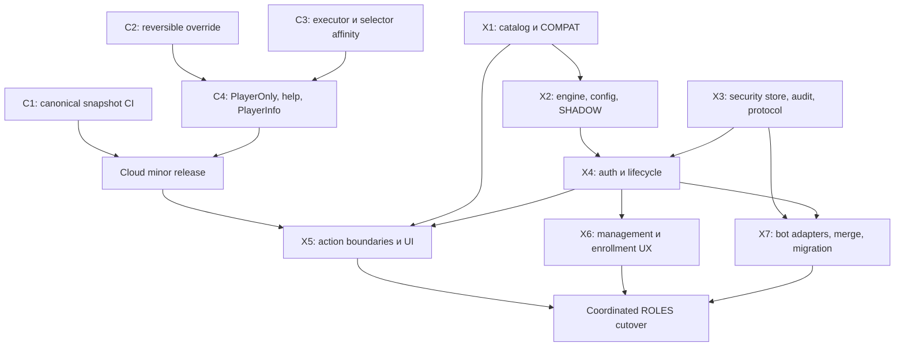

# Permissions и Cloud: план реализации

Статус: план PR и критерии приёмки; runtime changes ещё не сделаны.
Дата: 2026-10-06.
Нормативные контракты:
[XCore](../architecture/permissions-design-spec.md),
[cloud-mindustry](../../../cloud-mindustry/docs/design/roadmap-implementation.md).
[Decision record](../architecture/permissions-and-cloud-roadmap.md).

## 1. Зависимости PR

C1/C2 можно выпускать patch releases независимо. X1/X2 не ждут library release.
X3 protocol/store можно готовить независимо от engine. X5 допускает отдельные
review commits по action families, но до ROLES весь inventory должен быть закрыт.
Не объединять library API change, credentials migration и UI replacement в один PR.

## 2. Cloud PR

| PR | Изменение | Проверка и release |
| --- | --- | --- |
| C1 | Build всех веток; canonical snapshot только main push | YAML/publish condition matrix; существующий build |
| C2 | Owned registration с displaced command и rollback попытки | Root/aliases/map+list, third-party replacement, repeated delete |
| C3 | SimulationExecutor per manager; coordinator; убрать blocking/global selector path | Controlled owner thread/queue; null main; worker fail; nested scratch; shutdown |
| C4 | PlayerOnly metadata/annotation, opt-in MindustryHelp, local PlayerInfo parser | Custom sender; compound permissions; paging/PREFIX/SKIP; ambiguity/IP |

Начать от актуального GitHub 0.3.0, не от старого локального main.
После C3/C4 следующий minor release, например 0.4.0, с migration notes.
Сохранить Java 17 и compile API v154.3. Отдельно проверить интеграцию v160.
XCore обновляет dependency и telemetry-wrapped coordinator на один
SimulationExecutor. Build/test/public API examples входят в соответствующий PR.

## 3. XCore PR

### X1 — catalog, actors и COMPAT

Ввести PermissionNodes, PermissionActor, PermissionService facade и mode.
Сначала заменить permissive CloudPermissionPolicy строгим adapter:
неизвестные nonempty nodes DENY; объявленные legacy STAFF в COMPAT используют
прежний active-admin check. Granular annotations подключать после checker.
Разделить ModerationController class-level admin на endpoint nodes.
Session validation проверяет Player identity/current connection, не только UUID.
Gcmd mapping captures local/remote origin с восстановлением context в finally.
Startup проверяет catalog leaves команд после регистрации.

Приёмка: прежний admin/console сохраняет известные commands, обычный player —
прежние public commands; typo не становится разрешённой командой; remote gcmd
не получает local permission-management через root/alias/prefix.
COMPAT не устраняет исторические auth/source проблемы сам по себе.

### X2 — чистый engine, definitions и SHADOW

Records, matcher, normalized definitions/hash, inheritance validation, compiled
indices, decision/explain, injected UTC clock и monotonic ticker.
ConfigFactory разрешает общий permissions.toml тем же способом, что secrets.
Definitions generation/reload атомарны; invalid reload сохраняет прежние definitions.
SHADOW сравнивает legacy result с candidate; без native projection и live mutation.
Готовить bounded report: node/reason counts и отдельный диагностический inventory.

Приёмка: таблица resolution из спецификации, multi-role conflicts, independent
grant expiry, unknown node/role, direct precedence, scope, clock boundaries.
Проверить cycle/missing parent, malformed patterns и duplicate contradictory rules.
Shadow fixtures явно различают сохранение поведения и намеренную новую policy.

### X3 — security document, transaction audit и protocol

PermissionSubjectRepository без DataRepository inheritance. Authorization и
credential projections разделены; grants/credentials/revision/epoch — один subject.
CAS и audit/receipt в Mongo transaction; unique partial operation-ID index.
Новые audit enum values поддерживаются readers до начала записи.
Не включать authoritative writes из production COMPAT/SHADOW.

В xcore-protocol добавить invalidation event и узкую compatibility RPC пару
из спецификации; обновить route specs и valid/invalid fixtures. Затем generation,
generation check, Python/Java contract tests, release и consumers.
Handwritten wire DTO в plugin/bot запрещён. Existing generic audit transport
проверить на новые action values; новый audit event не вводить без необходимости.

Приёмка с replica-set Mongo: две concurrent mutations не теряют grants;
audit failure откатывает state; repeated operationId не повторяет effect;
тот же ID с иным intent возвращает conflict; absent-subject race корректна.
Save обычного profile не меняет security state. Publish error после commit
возвращает сохранённый result и не запускает повторную запись.
Это integration tests transaction semantics, а не mock assertions вызовов Mongo.

### X4 — общий async auth и permission lifecycle

AdminAuthService читает credential view, проверяет/меняет credentials через
conditional repository path; chat и AdminModIntegration используют один flow.
Добавить enrollment/epoch/token summary и generation fencing. Rate limits,
BCrypt, token cap/TTL сохраняются. Никаких Player/PlayerData references в worker.
ConnectionHandler подключает initial load, definitions/current-request validation,
periodic batch refresh, high-water invalidations, expiry pulse и projection.
Startup/shutdown проходят через существующий coordinator, без constructor I/O.

В тестовом ROLES убрать native registry write из login. Legacy credential
adapter читает проверенный native source, не derived Player.admin; logout
suppresses его до новой activation. Native add/unadmin остаётся явным source.

Приёмка: login -> active; moderator остаётся native=false; last staff revoke
снимает proof; partial source revoke сохраняет независимый grant.
Logout/reconnect/reset во время verify не допускают late activation. Старый
in-flight completion не освобождает guard новой connection.
Ни packet login, ни refresh не делают BCrypt/Mongo на game thread.

### X5 — общие action boundaries, menus и native packets

Закрыть inventory ниже. Checked moderation methods принимают actor и intent;
null Session не означает console. Async target lookup возвращает immutable ref,
перед acceptance действие rechecks current permission на main.
UI reducer/callback проверяет права заново. Help использует Cloud composite result,
PlayerOnly и disabled policy; ADMIN category остаётся навигацией.

Приёмка: direct service call, command, packet и menu достигают одной policy.
Меню, открытое до revoke, не исполняет старое действие. Target lookup,
завершившийся после revoke/reconnect, не принимает intent.
Отзыв после acceptance не отменяет уже начатый storage commit.

### X6 — management, enrollment и диагностика

Local console endpoints из спецификации; typed flags, grant IDs, reasons,
explicit --replace/--reset, info/check/eligible/nodes/reload.
XCore PlayerTarget parser без I/O; async repository resolver. Signed/zero PID
поддерживается; sentinel и ambiguous names дают ошибку. PID != entity ID.
Добавить /staff-setup; existing /login и /logout применяются к generic staff.
First password требует explicit invite и для legacy Discord-approved account;
existing password/token переносится. Этот bootstrap change объяснить в release notes.
Fluent messages объясняют eligibility/activation/freshness, без секретов.

Приёмка end-to-end: grant moderator -> explicit online invite -> private setup
-> mute/kick -> logout -> login -> expiry/revoke. Invite связан с UUID/server/
USID/current connection, single-use, bounded deadline; нельзя использовать
после disconnect/reset или на другом аккаунте. Role add offline сам не активирует.
Management недоступен remote console и player с '*'; own info остаётся доступным.

### X7 — bot adapters, security merge и migration tooling

Bot add/remove/reset переходят на compatibility RPC, без прямой записи legacy
password_hash/is_admin после cutover. Success только после committed response.
Timeout retry сохраняет operationId; нет fallback к прежнему writer.
Common permissions.toml содержит configured staff bindings (два/три уровня);
bot читает его через PERMISSIONS_CONFIG_PATH, plugin проверяет mapping hash.
Member updates и periodic reconcile вызывают SYNC_DISCORD_ROLES по всем linked
subjects, включая non-admin moderators. У каждого binding свой source.
Source reconciliation меняет только Discord-owned set configured guild; manual grants
не затрагиваются. Missing cache/API/role — error; verified empty membership —
revoke. No-op/duplicate не создаёт повторного grant effect.
CAS conflict требует нового чтения membership/link/revision; stale intent не rebase.
Link/unlink хранит canonical binding в subject, обновляет profile mirror и grants
transactionally. Sync после link запускается после confirmed commit, не publish.
Bot credential-status readers используют новый safe summary,
а не frozen legacy password field.

Plugin и bot account-merge writers больше не OR/copy security fields.
Target credentials сохраняются; source credentials отзываются; manual transfer
только explicit local operation; Discord recomputed; два subject invalidated.
Retired source subject не разрешает новый login/re-grant.

Migration tool: dry-run/report/export/checkpoint/import/verify. Idempotent import
не перезаписывает subject с новой revision. Report классифицирует native entries
и incomplete legacy token expiry. Узкий rollback export/migration, не универсальный
storage migration framework.
Приёмка: повтор import не дублирует grants/epoch; неоднозначный native source
не становится global admin; bot no-op/retry/reset отражаются в audit и revision.
Проверить moderator/admin/senior bindings, role rename, несколько ролей,
изолированный scope, отзыв только одного source, role update/link races,
mapping mismatch, partial/verified-empty guild state и сохранение manual grants.
Existing bot slash checks проаудировать: game staff mapping не выдаёт автоматически
head/admin infrastructure, reset или role-management privileges.

## 4. Inventory прямых admin checks

93 textual совпадения .admin на baseline — начальная подсказка, не число
authorization sites. Annotations/comments/status fields также входят в поиск.

| Место | Что перевести / сохранить |
| --- | --- |
| CloudPermissionPolicy, registrar, controllers | Named checks, strict catalog, per-endpoint annotations |
| ModerationService / ModerationActor | Checked actor boundary; убрать null -> CONSOLE для user actions |
| CloudGuardConfigurer | xcore.bypass.playtime |
| VoteController | xcore.votes.cancel; target votekick.immune |
| EventFlows / EventDraftService | Major/edit-others nodes; сохранить owner и lifecycle conditions |
| MapFlows / MapUiController | Force-rtv/force-vnw и callback recheck |
| PlayerMenu / profile rendering | settings.others/private-info; отделить target badge от viewer privilege |
| AuditHistoryUiController / flows | Staff/others gates до read и navigation; прежняя own history доступна |
| HelpMenu / ServerHelpController | Cloud compound permission API; убрать общий ADMIN category gate |
| AdminRequestHandler | Native action node + прежние world/target constraints, target immunity |
| AdminTools custom packets | Ban/cancel и другие endpoints проверяют свой node |
| AdminAuthService / ConnectionHandler | Async auth, source proof, lifecycle/native projection |
| DiscordAdminAccessService / bot mongo_store | Source-owned adapter; убрать legacy authoritative writers |
| AccountMergeService / bot merge | Explicit security merge вместо admin OR/token copy |
| SessionService | Identity validation; cache не становится storage writer permissions |
| PlayerLimitCheck / discovery capacity | Сохранить pre-session native admission без Mongo lookup |
| ServerSelectorUiController | Legacy full-server presentation hint, без гарантии admission |
| Leaderboard/status/admin icons | Presentation; статус не становится authorization input |

В каждом migrated action сохранить остальные условия: ownership, disabled state,
playtime, game phase, target validation. Permission grant не отменяет их.
После X5 повторить rg inventory и классифицировать все оставшиеся прямые reads/
writes. В ROLES Player.admin writers допускаются только projection/engine lifecycle;
pre-session engine reads и presentation имеют подписанные исключения в review.

## 5. Обязательные сценарии, а не тест каждого accessor

| Группа | Сценарий и ожидаемое поведение |
| --- | --- |
| Resolution | Exact/prefix/direct/scope/tie deny; истечение одного из нескольких grants |
| Activation | Role без proof запрещает STAFF; valid password не создаёт отсутствующую роль |
| Generation | Late login/load после logout/reconnect/reset/definitions reload игнорируется |
| Sync | Revision 12 затем 11; read 10 после event 12; duplicate event; missed event/reconnect |
| Freshness | До boundary ALLOW; в boundary stale DENY; старый DENY остаётся; no fallback |
| Storage | CAS conflict, absent insert race, failed audit, idempotent operation receipt |
| UI | Open-before-revoke; callback и paging не раскрывают/не выполняют staff action |
| Native | Existing UUID+USID/IP behaviour, independent source, no derived-registry reimport |
| Origin | Null identity, gcmd remote, alias/prefix, asynchronous mapping сохраняет origin |
| Enrollment | One-time/expiry/binding/reset; новый moderator проходит полный путь |
| Compatibility | Старый AdminTools status/requests; обычные игроки и own history |
| Migration | Dry-run, повтор import, ambiguous native, profile save, merge, rollback |

Use controlled clock/ticker/queues, headless server UI/menu tests и Mongo replica
set integration. Не использовать thread sleeps для доказательства races.
Testkit нужен для real wire/menu interaction; graphics/client-mod UI tests
не нужны, пока AdminTools client не изменяется.
Без runtime edits текущего документа запуск Gradle не является проверкой проекта.

## 6. Production cutover

1. Выпустить library/protocol и совместимые plugin/bot readers/adapters.
   Production остаётся COMPAT/SHADOW; mutation endpoints для новых grants закрыты.
2. SHADOW report на текущих sources; утвердить role definitions и native inventory.
   Поведение нового moderator заранее проверить в изолированном окружении.
3. Export/checkpoint. На короткое окно остановить legacy credential/admin writers,
   включая bot link/reconcile/reset/merge, chat и mod auth; дождаться in-flight writes.
4. Import в permission_subjects, verify counts/source/hash/token expiry. Не запускать
   одновременно старый и новый credential writer для shared Mongo.
5. Coordinated deployment на всех production writers: включить новые credential
   consumers и ROLES, пересоздать sessions, включить compatibility RPC и management.
   Server-local mode не разрешает смешанную production запись старых/new credentials.
6. Smoke ordinary player, legacy full admin, moderator, organizer; local management;
   bot grant/revoke/reset; Redis missed-event recovery и native packet checks.
7. Наблюдать bounded mismatch/refresh/pending/revocation metrics. Publish failures
   восстанавливаются reload; Mongo failure не вызывает automatic COMPAT.

Не переходить к шагу 5, если есть неклассифицированный privileged action,
неподдерживаемый security writer или непроверенный rollback export.
После ROLES rollback выполняется explicit migration с очисткой derived flags
и новой authentication; granularity moderator нельзя выразить одним legacy boolean.
